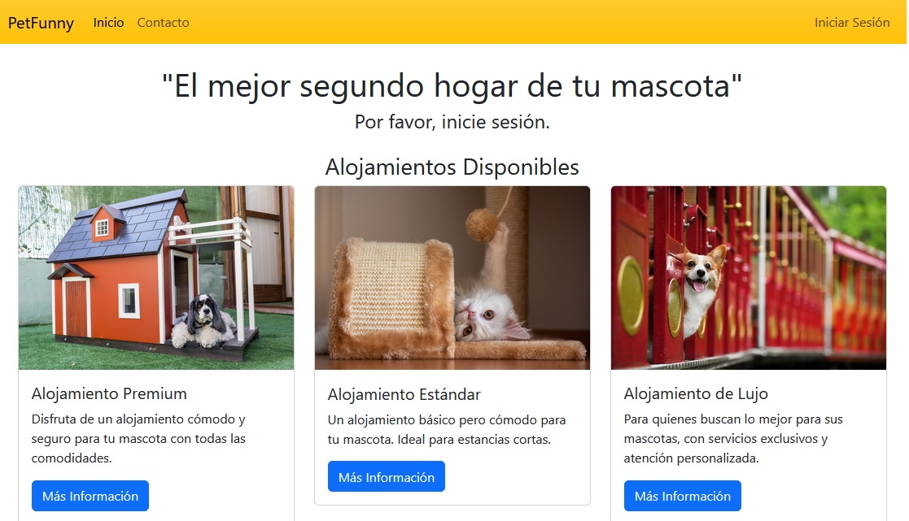
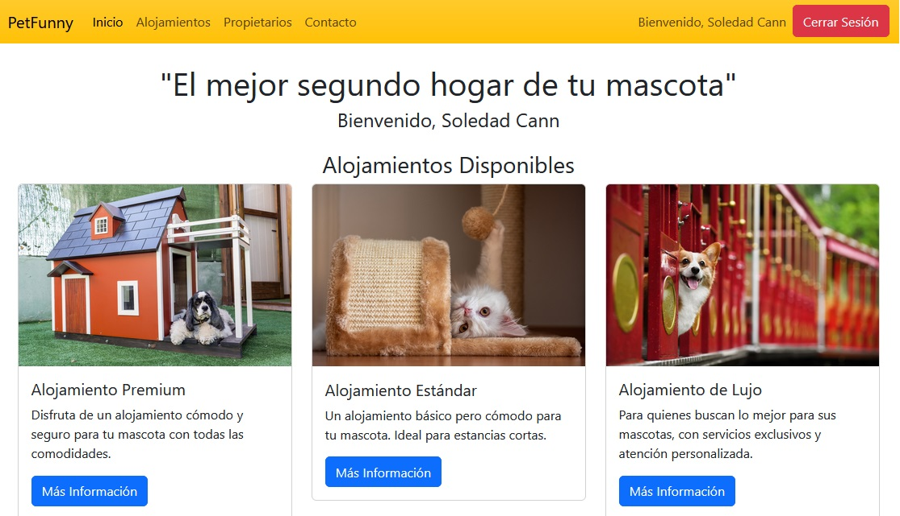
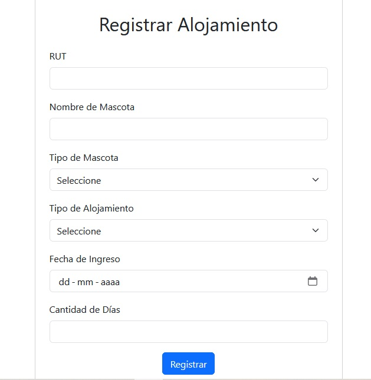
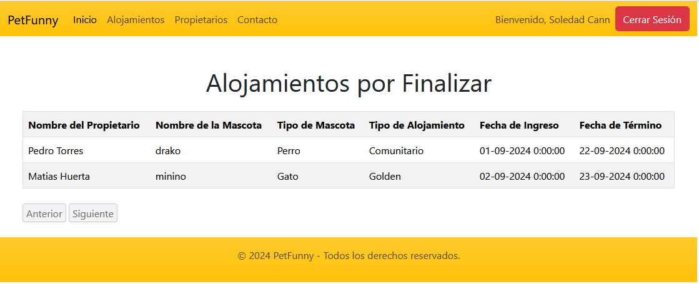

# PetFunny

PetFunny es una aplicación web desarrollada con ASP.NET que permite la gestión de alojamientos de mascotas. El proyecto está diseñado con una arquitectura en capas, asegurando una separación clara de responsabilidades entre la capa de datos, capa de negocio y capa de presentación. Además, la aplicación utiliza un servicio WCF para la comunicación entre capas y proporciona un sistema de autenticación basado en formularios para garantizar la seguridad.

## Características Principales

- **Arquitectura en Capas**: El proyecto sigue una arquitectura en capas, dividiendo claramente la capa de acceso a datos, la capa de negocio, y la capa de presentación.
- **ASP.NET con WCF**: El servicio se desarrolla como una Aplicación de Servicio WCF, utilizando mensajería XML para la ejecución y/o resultados de las operaciones del servicio.
- **Seguridad**: La seguridad se implementa utilizando el modelo de seguridad de ASP.NET con autenticación basada en formularios.
- **Entity Framework**: El acceso a datos se realiza a través de ADO.NET Entity Framework con un Modelo de Entidades (EDM) para interactuar con la base de datos.
- **Validaciones**: Las validaciones de los datos se implementan utilizando controles de validación o propiedades de los controles de servidor en ASP.NET.
- **Mapa del Sitio**: La navegación se organiza mediante un Mapa del Sitio, facilitando la interacción del usuario con la aplicación.

## Requerimientos del Proyecto

El desarrollo de PetFunny considera los siguientes aspectos fundamentales:

1. **Arquitectura en Capas**: La aplicación está diseñada con una clara separación de responsabilidades entre las diferentes capas.
   
2. **Proyecto ASP.NET Vacío**: El desarrollo inicial parte de un proyecto ASP.NET vacío, sobre el cual se construyen todas las funcionalidades necesarias.

3. **Mensajería XML**: Se utiliza mensajería XML para la comunicación entre capas a través del servicio WCF, asegurando una integración eficiente y escalable.

4. **Aplicación de Servicio WCF**: La aplicación incluye un servicio WCF que maneja la lógica de negocio y la comunicación con la base de datos.

5. **Seguridad basada en ASP.NET**: La autenticación se realiza utilizando formularios, con seguridad proporcionada por ASP.NET.

6. **ADO.NET Entity Framework**: El acceso y manipulación de datos se gestionan mediante ADO.NET Entity Framework, utilizando un Modelo de Entidades (EDM) para interactuar con la base de datos.

7. **Validaciones de Datos**: Las validaciones necesarias se implementan mediante controles de validación en ASP.NET o mediante propiedades de los controles de servidor.

8. **Mapa del Sitio**: La navegación en la aplicación se gestiona a través de un Mapa del Sitio, asegurando una estructura clara y fácil de seguir.

## Imágenes de la Aplicación

A continuación, se presentan algunas imágenes de la aplicación PetFunny:

### Pantalla de Inicio

### Gestión de Inicio de Sesión

### Detalle de Alojamiento

### Pantalla Finalización Alojamiento

## Futuras Implementaciones

En futuras versiones de la aplicación, se planea implementar las siguientes características:

- **Gestión de Usuarios**: Integración de un sistema de gestión de usuarios con seguridad mejorada mediante cifrado de datos.
- **Reportes Detallados**: Generación de reportes detallados sobre las estadías de las mascotas y otros aspectos relevantes.
- **Notificaciones Automáticas**: Implementación de un sistema de notificaciones para alertar a los usuarios sobre eventos importantes relacionados con los alojamientos.

